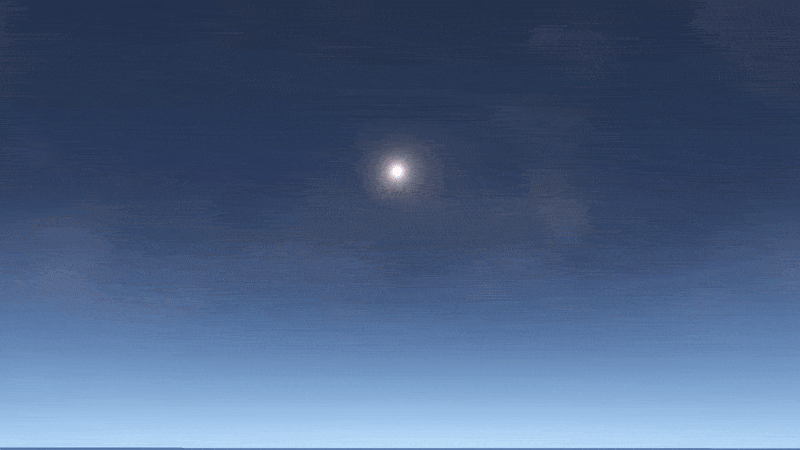
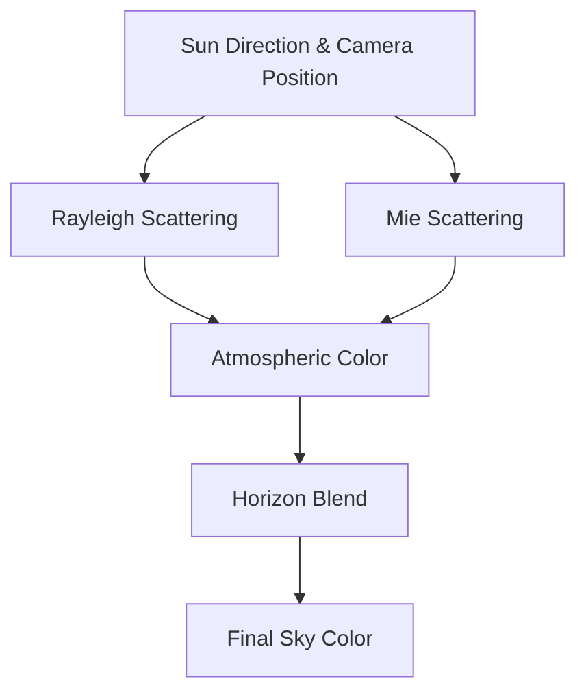

# Procedural Skybox Shader (Unity BRP)

  

## Summary
A fully procedural skybox shader for Unity's Built-in Render Pipeline (BRP).  
Generates dynamic skies with adjustable parameters for time of day, atmospheric scattering, and horizon blending.

## Features
### 1. **Physically-Inspired Sky Color**

- **Atmospheric Scattering**: Rayleigh + Mie scattering simulation for realistic gradients
- **Sun Position Control**: Adjustable azimuth & elevation
- **Day/Night Cycle Ready**: Smooth transitions from sunrise to sunset
- **Color Temperature Shift**: Accurate warm/cool light progression

**Shader Code Flow**:

### 2. Dynamic Sun & Horizon
- **Procedural Sun Disc**: Adjustable size and brightness
- **Horizon Falloff**: Smooth gradient from ground to zenith
- **Custom Ground Color**: Blend with fog or terrain palette
- **Exposure Control**: Adapts to time-of-day intensity

### 3. Stars & Night Mode
- **Procedural Star**: Generated via noise function
- **Star Density & Size**: Adjustable parameters
- **Night Sky Tint**: For artistic or realistic styles
- **Auto Fade**: Stars gradually appear/disappear at dusk/dawn

## Limitations
- **BRP Only**: Not compatible with URP/HDRP

## Sample Scene
The repository includes a demonstration skybox on 'Skybox' Folder showing:
- Day/night cycle blending
- Starfield activation on Night

Just 'drag n drop' into scene skybox to use it.

## License
This project is licensed under the MIT License.
Use it freely for learning, modification, or integration into your own experiments.
